- [Angular - Fernando Herrera](#angular---fernando-herrera)
  - [TypeScript Refresh](#typescript-refresh)
    - [Modulos y export/import](#modulos-y-exportimport)
    - [Destructiring, rest operator y spread operator](#destructiring-rest-operator-y-spread-operator)
      - [Destructuring (Desestructuración):](#destructuring-desestructuración)
      - [Rest Operator (...):](#rest-operator-)
      - [Spread Operator:](#spread-operator)
  - [Angular Basics](#angular-basics)
    - [Que es Angular](#que-es-angular)
    - [Los 5 bloques fundamentales de angular](#los-5-bloques-fundamentales-de-angular)
    - [Primer proyecto en angular](#primer-proyecto-en-angular)
    - [Explicacion de los archivos creados x ng new](#explicacion-de-los-archivos-creados-x-ng-new)
    - [Componentes en angular](#componentes-en-angular)
    - [App Component](#app-component)
  - [Agrupar los arhchivos en modulos](#agrupar-los-arhchivos-en-modulos)
    - [Creación de módulos con CLI](#creación-de-módulos-con-cli)
  - [Directivas ngClass](#directivas-ngclass)
  - [@Input()](#input)
  - [Data binding](#data-binding)
  - [@Output](#output)
  - [Servicios](#servicios)
  - [UUI library](#uui-library)
  - [Deploy de la Aplicacion](#deploy-de-la-aplicacion)
    - [deploy local](#deploy-local)
    - [Deploy en Netlifly](#deploy-en-netlifly)
    - [Deploy en GitHub Pages](#deploy-en-github-pages)
- [Frontend con Angular - platzi](#frontend-con-angular---platzi)
  - [Curso de Angular 17: Creación de Aplicaciones Web - platzi](#curso-de-angular-17-creación-de-aplicaciones-web---platzi)
    - [Instalaciones](#instalaciones)
    - [Creacion de un proyecto](#creacion-de-un-proyecto)
    - [Componentes](#componentes)
- [Angular freecodecamp Course](#angular-freecodecamp-course)
  - [Intro](#intro)
    - [SPA - Single Page Application](#spa---single-page-application)
      - [SPA y Angular](#spa-y-angular)
  - [Primera app angular](#primera-app-angular)
  - [Arquitectura de una app Angular](#arquitectura-de-una-app-angular)
    - [Modulos](#modulos)
    - [Componentes](#componentes-1)
  - [Creando nuestro primer componente](#creando-nuestro-primer-componente)
  - [Data binding (enlace de datos)](#data-binding-enlace-de-datos)
  - [Envío de datos entre los componentes](#envío-de-datos-entre-los-componentes)
    - [Características principales](#características-principales)
    - [Metadata](#metadata)
    - [INPUT](#input-1)
    - [OUTPUT y EventEmitter](#output-y-eventemitter)
  - [Servicios](#servicios-1)
    - [Caracteristivas](#caracteristivas)
    - [Servicios y dependencias](#servicios-y-dependencias)
  - [Directivas](#directivas)
    - [Caracteristicas](#caracteristicas)
  - [PIPES](#pipes)
    - [Agregar bootstrap en Angular.](#agregar-bootstrap-en-angular)
  - [Routing o Enrutamiento](#routing-o-enrutamiento)
  - [Estructuras de Control](#estructuras-de-control)
    - [ngIf](#ngif)
    - [ngFor](#ngfor)
    - [ngSwitch](#ngswitch)
    - [ngClass](#ngclass)
    - [ngStyle](#ngstyle)
    - [ngContainer](#ngcontainer)
- [Intro to TypeScript](#intro-to-typescript)
    - [crear TS app](#crear-ts-app)
    - [Data types](#data-types)
    - [Functions](#functions)
    - [Classes](#classes)
    - [Interfaces](#interfaces)
    - [Modules](#modules)
    - [Object deconstruction](#object-deconstruction)
- [Angular crash course](#angular-crash-course)
  - [What is angular?](#what-is-angular)
    - [Angular Services](#angular-services)
    - [Angular CLI](#angular-cli)
  - [Why angular?](#why-angular)
  - [Creating Angular app](#creating-angular-app)
    - [Estructura del proyecto](#estructura-del-proyecto)
    - [Crear un nuevo componente utilizando angular/cli](#crear-un-nuevo-componente-utilizando-angularcli)
    - [Conceptos básicos de TS](#conceptos-básicos-de-ts)
    - [Componentes de angular](#componentes-de-angular)
    - [Decorator @Input()](#decorator-input)
    - [Decorator @Output()](#decorator-output)
    - [Directives](#directives)
      - [ngStyle](#ngstyle-1)
    - [String Interpolation](#string-interpolation)
    - [Property Binding](#property-binding)
    - [Event Binding](#event-binding)
    - [Data Binding](#data-binding-1)
      - [Custom Validators](#custom-validators)
    - [Directivas de control](#directivas-de-control)
      - [ngIf](#ngif-1)
      - [ngFor](#ngfor-1)


# Angular - Fernando Herrera

## TypeScript Refresh

Si queremos ejecutar codigo TS en consola, sin necesidad de ir al navegador y ver los outputs en consola, tenemos q crear un proyecto con `node` e instalar las dependencias siguientes como dev:

`npm install typescript ts-node @types/node --save-dev`

Una vez instaladas tenemos q crear un archivo de configuracion de TS 

`npx tsc --init`

y ahora para ejecutar los archivos en TS usmaos el comando 

`npx ts-node src/index.ts`

Para no tener q ejecutar este comando tan largo podemos generar un script en el archivo `package.json`

```json
{
  "name": "01_typescript_intro",
  "version": "1.0.0",
  "main": "index.ts",
  "scripts": {
    "test": "echo \"Error: no test specified\" && exit 1",
    "start":"npx ts-node 01-basic-types.ts"
  },
  "author": "",
  "license": "ISC",
  "description": "",
  "devDependencies": {
    "@types/node": "^22.7.4",
    "ts-node": "^10.9.2",
    "typescript": "^5.6.2"
  }
}

```

y ahora para ejecutar basta con ejecutar:

`npm start`


Tambien podemos compilar el codigo TS en un JS con la ayuda del comando :

`npx tsc`

y ya podemos ejecutar el archivo js directamente con node

`node index.js`

### Modulos y export/import

Cuando ponemos al final de un archivo `export{}` convierte ese archivo en módulo y solo se exportara lo q pongamos dentro del objeto `export`. Otro modo de hacerlo es usando `export` delante de la variable/objeto/funcion... q queramos exportar

```js
interface MyProducts {
    description:string;
    price:number;
}


export {MyProducts};
``` 
o 
```js
export interface MyProducts {
    description:string;
    price:number;
}
``` 
Tenemos que ir con cuidado con las exportaciones/importaciones q los archivos q intervengan no tengan codigo ejecutando, ya q por defecto cuando se haga el import el archivo q se importa se ejecutara.

### Destructiring, rest operator y spread operator

#### Destructuring (Desestructuración):
Es una forma de extraer valores de arreglos u objetos de manera más concisa.

Con Arreglos:

```js
javascriptCopy// Forma tradicional
const numeros = [1, 2, 3];
const primero = numeros[0];
const segundo = numeros[1];
```

```js
// Destructuring
const [primero, segundo, tercero] = numeros;
// primero = 1, segundo = 2, tercero = 3
```
Con Objetos:

```js
javascriptCopyconst persona = { nombre: 'Juan', edad: 30, ciudad: 'Madrid' };

// Destructuring de objetos
const { nombre, edad } = persona;
// nombre = 'Juan', edad = 30
```
#### Rest Operator (...):

Permite recoger múltiples elementos en un arreglo.


En Arreglos:
```js
javascriptCopy// Recoger elementos restantes
const [primero, ...resto] = [1, 2, 3, 4, 5];
// primero = 1, resto = [2, 3, 4, 5]
```

En Funciones:
```js
javascriptCopy// Agrupar argumentos indefinidos
function sumar(...numeros) {
  return numeros.reduce((a, b) => a + b, 0);
}
sumar(1, 2, 3, 4) // Devuelve 10
```

En Objetos:

```js
javascriptCopyconst { nombre, ...demasInfo } = persona;
// nombre = 'Juan'
// demasInfo = { edad: 30, ciudad: 'Madrid' }
Combinando Destructuring y Rest:
javascriptCopyconst [primero, segundo, ...demas] = [1, 2, 3, 4, 5];
// primero = 1
// segundo = 2
// demas = [3, 4, 5]
```

Beneficios:

Código más limpio y legible
Extracción simple de datos
Flexibilidad al manejar arreglos y objetos
Copy

#### Spread Operator:

Es un operador (...) que "expande" un elemento iterable (como arrays u objetos) en sus elementos individuales.
Usos principales:

Copiar Arrays:

```js
javascriptCopyconst original = [1, 2, 3];
const copia = [...original]; 
// copia es un nuevo array [1, 2, 3]
// Es diferente a original, no es una referencia
```


Combinar Arrays:

```js
javascriptCopyconst arr1 = [1, 2, 3];
const arr2 = [4, 5, 6];
const combinado = [...arr1, ...arr2]; 
// [1, 2, 3, 4, 5, 6]

// Añadir elementos
const nuevo = [...arr1, 7, 8]; 
// [1, 2, 3, 7, 8]
```

Pasar Argumentos a Funciones:

```js
javascriptCopyfunction suma(a, b, c) {
  return a + b + c;
}

const numeros = [1, 2, 3];
console.log(suma(...numeros)); // 6
```

Con Objetos:


```js
javascriptCopyconst objeto1 = { x: 1, y: 2 };
const objeto2 = { z: 3 };

// Combinar objetos
const combinado = { ...objeto1, ...objeto2 };
// { x: 1, y: 2, z: 3 }

// Sobreescribir propiedades
const modificado = { ...objeto1, y: 10 };
// { x: 1, y: 10 }
```


Clonar y Modificar Objetos:

```js
javascriptCopyconst original = { a: 1, b: 2 };
const copia = { ...original }; // Copia superficial

const modificado = { ...original, c: 3 };
// { a: 1, b: 2, c: 3 }
```

En Funciones con Argumentos Rest:

```js
javascriptCopyfunction mostrar(...args) {
  console.log(args); // Convierte los argumentos en un array
}

mostrar(1, 2, 3); // [1, 2, 3]
```
Consideraciones:

Hace una copia superficial (no clona objetos anidados)
Útil para manipular arrays y objetos sin modificar los originales
Muy usado en programación funcional y React


## Angular Basics

### Que es Angular

- Es un framework estandarizado para crear aplicaciones SPAs, es decir todos los proyectos de angular utilizaran al final los mismo componentes.
- Angular viene con todo preparado para poder trabajar
- Angular crea aplicaciones modulares

### Los 5 bloques fundamentales de angular


1. Componentes => Es un elemento formado por un bloque de html y su clase de TS principalmente. Se busca que sean lo más simples posibles y el menor código posible.
2. Rutas => permite mostrar distintos componentes en funcion de la url solicitada
3. Directivas  
   1. directivas de componentes => es parecido a los componentes en el sentido q es un trozo de html con funcionalidad integrada que se inserta dentro de otro componente, un "componente" q se integra en otro
   2. de atributos => cambian la apariencia/comportamiento de un elemento, de otro componento o de una directiva.
   3. estructurales => modifican el DOM o el HTML (añadiendo/eliminando html)

4. Servicios => son lugares centralizados de información donde se controla el estado de los componentes. Tb si tenemos botones x ejemplo llaman tb a servicios.
5. Modulos => permite agrupar todos los componentes anteriores (componentes, rutas, directivas y servicios) inclusive pueden albergar otros módulos.

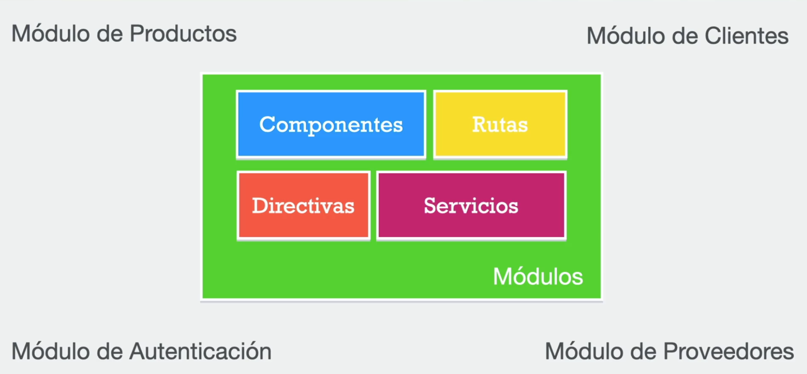

incluso hay paquetes disponibles para usarlos en tu aplicación, por ejemplo hay modulos que te muestran calendatios, o módulos para formularios, etc... con el objetivo de no volver a crear algo q ya esta hecho, simplemente reutilizarlo.

**Desde Angular v17, por defecto los proyectos trabajan sin módulos (module-less)**

**Pero para trabajar de forma tradicional:**

```js
ng new <nombre de la aplicación> --standalone false
```
o 

```js
ng new <nombre de la aplicación> --no-standalone
```

### Primer proyecto en angular

1. Primero instalar localmente el cli de angular(para poder tener diferentes verisones de angular en función del proyecto)

`npm install @angular/cli@18 --save-dev`

2. comporbamos q se ha instalado bien (como hemos instalado localmente tenemos q ejecutar todos los comando `ng` precedidos de `npx`)

`npx ng version`

3. cuando hacemos esto creamos localmente un `node_modules` y `package.json` pertenecientes al cli de angular 

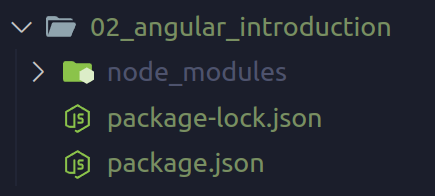

4. creamos nuestro proyecto. Ahora trabajaremos como en las versiones anteriores a la 17 de angular, cuando se usaban los modulos. Recordemos q a partir de la v17 de angular no se trabaja con modulos.
   Para iniciar un proyecto q sea compatible con modulos usaremos la flag `--no-standalone`

   `npx ng new my_project --no-standalone`

Aquí tendremos q escoger ciertas opciones para configurar nuestro proyecto: 
  - si usaremos CSS o algun preprocesador de CSS tipo SASS, Less,..
  - si queremos activar:
    - SSR (server-site rendering)  => la pagina se crea en el servidor y es entregada al navegador (accedemos a un endpoint en el server se monta el html y se entrega al browser) esto es para optimizar el SEO y muy buena si en la app hay contenido dinámico como un dashboard 
    - SSG (static site generation) =>  en SPA al hacer build se generan todos los html necesarios de la app y cuando el cliente (browser) lo solicita le lleva todo el html por lo q la app es muy rapida pero no sirve cuando tiene contenido dinámico

    * entonces Angular es capaz d e combinar ambas tecnologías sirviendo todas las partes estaticas de nuesta app como SSG y las partes dinamicas renderizarlas en el servidor (SSR)

    * PARA TRABAJAR DE MANERA CLÁSICA A ESTA PREGUNTA RESPONDEREMOS Q `NO ACTIVAREMOS SSR NI SSG`

El resultado es la siguiente estructura de carpetas

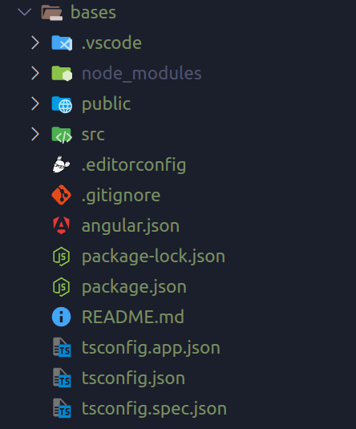

5. entramos dentro del directoria principal de nuestra app (bases) y para lanzar el servidor hacemos

`npx ng serve` o `npx ng serve -o` para q cuando termine de compilar abra el navegador directamente.

### Explicacion de los archivos creados x ng new

1. `.editorconfig` 

este archivo permite settear las configuraciones para el vscode para que todos las personas q trabajen en el proyecto lo vean del mismo modo ( es solo visual, por ejemplo numero de espacios, los strings con ' en lugar de ", etc..)

2. `angular.json`

Configuraciones globales de angular para la ejecucion de la aplicacion.

3. `package.json`

es propio de las aplicaciones de nodeJS ya que Angular está construído sobre nodeJS. Tenemos los scripts, comandos para compilar la app o lanzar el servidor etc...

4. Assets 

es un directorio donde guardamos todos los elementos que nunca van a cambiar en nuestra aplicación, como las imagenes, los loaders, incluso js, css,... recursos estáticos.


Directivas principales de angular:

* ngIf
  
  Ayuda a mostrar ciertos elemntos html, de hecho los elementos html q no entran en el if son eliminados/destruidos 

* ngFor

  nos permite iterar sobre elmentos o duplicar elementos 


### Componentes en angular

Tienen  3 partes 

1. archivo .ts

Es el realmente importante. Tendrá la lógica del componente

2. archivo .html

Este archivo .ts va a depender de otro elemento que será código `html` q lo podemos escribir inline en el propio .ts o si es más extenso de 4 líneas se recomienda ponerlo en un archivo externo.

3. archivos css

un componente puede tener tantos archivos css como necesitemos. Una propiedad importante es q este css esta encapsulado, es decir todo el código css sólo se aplicará a ese componente no afectará al resto. Si ponemos un estilo para los H1 solo afectará a los h1 de ese componnete

4. archivos .spec

Son archivos que se utilizan en el proceso de testing automatico.

### App Component

los componentes los podemos crear manualmente o utilizando el angular CLI. Primero vamos a hacer manualmente. Dentro de la carpeta app creamos otra carpeta cn el nombre de nuestro componente q sera `counter` y dentro de esta los archivos necesarios (el css html y ts)

1. en el archivo .ts exportamos nuestra clase y cn el decorador indicamos el selector y templateURL styleUrl

```js
import { Component } from "@angular/core";

@Component({
  selector:'app-counter',
  templateUrl:'./counter.component.html',
  styleUrl:'./counter.component.css'
})
export class CounterComponent{

}

```

una vez hecho esto tenemos q registrar nuestro nuevo componente en el modulo principàl de la aplicacion 


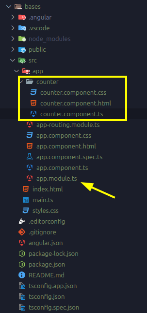

Ahora cada vez q use este componente, insertando su selector en mi html, cada contador sera independiente

```html
<app-counter></app-counter>
<app-counter></app-counter>
```

## Agrupar los arhchivos en modulos

Todo lo q tenga una funcoinalidad relacionada va a estar dentro de un mismo directorio. Por jemplo vamos a hacer un modulo de `Heroes` para ello podemos usar el angular/cli y especificarle un path 

`npx ng g c heroes/list --skip-tests`

A medida que vamos creando componentes en el `app.module.ts` se irán acumulando los imports, para evitar esto usaremos los modulos mediante el decorador `@NgModule`.
Un modulo no deja de ser una class de TS que sirve para encapsular 
Por lo general las apps de Angular tienen más de un módulo.

El módulo creado por nosotros debe tener la siguiente estructura:

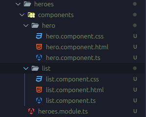


### Creación de módulos con CLI

`[npx] ng g m  <module's name>`

Una vez creado asi el componente podemos añadir todo el sistema de directorios q contendrá el módulo

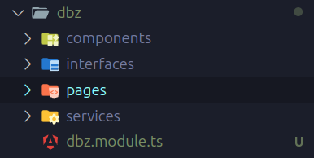

Las pages sera un componente que agrupe al resto de componentes que forman el módulo. Lo usaremos principalmente para el router, es decir cuando accedamos a una ruta concreta 
mostraremos las páginas asociadas a esa url.

## Directivas ngClass

## @Input()

se utiliza en los componentes para recibir datos desde un componente padre. Es decir, permite que un componente hijo pueda aceptar valores o datos que le son enviados desde su componente padre. Esto facilita la comunicación unidireccional entre componentes en Angular, donde el flujo de datos se da del componente padre hacia el componente hijo.

por ejemplo:

```js

// ARCHIVO .TS DEL PADRE
@Component({
  selector:'app-dbz-main-page',
  templateUrl:'./main-page.component.html'
})
export class MainPageComponent{

  public charcaters : Character[] = [
    {name:"krillin",power:500},
    {name:"Goku",power:9500},
    {name:"Vegeta",power:7500},
    {name:"Kid Trunks",power:10},
  ]
}

// ARCHIVO HTML DEL PADRE

<div class='col'>
  <componente-hijo [characterList]='charcaters'></componente-hijo>
</div>

```

en el hijo hay una propiedad que se llama `componente-hijo` y desde el padre se le asigna a `charcaters` q es una lista q existe en el padre. Entonces en el hijo la propiedad `characterList` recupera esa lista y en el html hijo se pinta los datos:

```html
<ul class="list-group">
  <li class="list-group-item"
  [ngClass]="{
    'list-group-item-dark': isLast,
    'list-group-item-primary':isEven
  }"
    *ngFor="let character of characterList;
    index as i
    last as isLast;
    even as isEven;
    ">
    <span class="text-primary"> {{ i }}</span>
    {{ character.name}} - {{character.power}}
    <span> es el ultimo : {{ isLast }} </span>
    <span> es par : {{ isEven }} </span>
  </li>
</ul>
```

## Data binding 

Angular permite vincular datos entre el componente y la vista de dos modos:

1. One-way data binding => los datos solo fluyen del componente al html
2. Two-way data binding => si hacemos un cambio en el componente se transmite al html y di hacemos un cambio en el html se pasa al componente 


para hacer el two-ways tenemos una sintaxi concreta, la llamada `banna in a box` [()] pq esta sintaxi, si recordamos cuando queremos escuchar 
un evento en angular usamos `()` como por ejempplo `(click)='my_function()'` si queremos enlazar una propiedad usamos `[]` por ejemplo `<input [value]='someData'>` 
cuando queremos hacer un two-way data biding combinamos ambas `[()]` junto con el ngModel `[(ngModel)]="character.power"` esta directiva `ngModel`
se usa en formularios (ya no es la mejor opción)

`ngModel` es una directiva en Angular que nos permite sincronizar el valor de un campo en el HTML (como un input, textarea, etc.) con una propiedad en el 
componente TypeScript. Esto se conoce como two-way data binding (enlace de datos bidireccional), ya que los cambios en el HTML se reflejan automáticamente 
en el componente, y los cambios en el componente se reflejan en el HTML. Es especialmente útil para formularios o cualquier campo donde el usuario ingrese datos.

entonces dsde el formulario se puede generar un evento submit q envie los datos al ts para recuperar los datos.

```js
<form action="" class="row" (ngSubmit)="emitCharacter()">

```
para ello usaremos `@Output` para emitir eventos al padre

##  @Output

Define una salida del componente que el componente padre puede suscribirse para escuchar. Las suscripciones estan relacionadas con el concepto de `RXJS` que es una libreria propia de angular para trabajar cn `programación reactiva` todo el tema de `observables` es rxjs. 
Un `observable` es un objeto que va emitiendo diferentes datos a lo largo de su ciclo de vida.

imaginemos que tenemos un componente padre que contiene una lista de persoanjes, y un componente hijo que es el encargado de pintar esa lista y además tiene un formulario para registrar un nuevo personaje, entonces estos dos comopnentes estan enlazados de tal modo que el padre
le pasa los datos al hijo para listar los datos y el hijo a través de un formulario le pasa los datos al padre para incluir un nuevo personaje a la lista del padre.

Para poder hacer esto necesitamos que el hijo emita un evento y necesitamos que el padre esté suscrito al componente hijo para escuchar ese evento.

Para generar ese evento creamos en el hijo un objeto `eventEmiter`

```js

@Output()
onNewCharacter : EventEmitter<Character> = new EventEmitter()

```
el objeto eventEmiter es un genérico por lo q puede emitir cualquier tipo de dato, así que le pasamos el dato que vamos a propagar, en nuestro caso será un objeto tipo Character.
Para que pueda ser escuchado debemos usar el decorador `Output()` dentro de los paréntesis podemos poner el nombre que queramos sino por defecto será `onNewCharacter` Este output permite emitir un evento de nombre onNewCharacter. 

Entonces dentro de la función que se activa cuando hacemos submit del formulario es dnd lanzaremos el evento 

```js
import { Component, EventEmitter, Output } from "@angular/core";
import { Character } from '../../interfaces/character.interface';

@Component({
  selector:'dbz-add-charcater',
  templateUrl: './add-character.component.html'
})
export class AddCharacterComponent{

  @Output()
  public onNewCharacter : EventEmitter<Character> = new EventEmitter()

  public character:Character = {
    name:"abc",
    power: 55
  }

  emitCharacter():void{

    if (this.character.name.length === 0) return;

    this.onNewCharacter.emit(this.character)

    // reseteamos el formulario
    this.character.name = ''
    this.character.power = 0
  }

}

```

para poder escuchar el evento en el componente padre usaremos la siguiente sintaxis:

```html

<dbz-add-charcater (onNewCharacter)="addNewCharacter($event)"></dbz-add-charcater>
```

con el `$event` capturamos lo que emite el evento, en este caso un objeto tipo Character


## Servicios

Tendrá la lógica de negocio para gestionar los datos. Una caracteristica principal de los servicios es q son un `singleton` solo puede haber una instancia de esta clase por lo q conserva el estado y el valor (datos) a lo largo de toda la aplicación(siempre y cuando lo hagamos mediante inyección de dependencias), esto es gracias a que lo declaramos con el decorador `@Injectable({providedIn: 'root'})` este provideIn : root, hace que sea un singleton para toda la app.

En nuestro caso el objetivo de crear un servicio es poder tener nuestros datos disponibles donde queramos, es decir nuestros personajes de dbz.

Tenmos que tener en cuenta que todos los objetos en js se pasan como referencia por lo q si lo cambiamos en un sitio tb nos modificará el original. Más adelante veremos técnicas para romper esa referencia.

Nuetsro servicio tendria esta pinta:

```js

import { Injectable } from '@angular/core';
import { Character } from '../interfaces/character.interface';

@Injectable({providedIn: 'root'})

export class DbzService {

  public charcaters : Character[] = [
    {name:"krillin",power:500},
    {name:"Goku",power:9500},
    {name:"Vegeta",power:7500},
    {name:"Kid Trunks",power:10},
  ]

  public addNewCharacter(character:Character):void{

    this.charcaters.push(character)

  }

  public delOneCharacter(idx:number):void{

    this.charcaters.splice(idx,1)

  }
}
```

Ahora este se puede inyectar dnd queramos , hasta ahora teníamos toda esta información en el main-page(que es componente padre y de él pasa al resto de nuestra aplicaciópn) así que le inyectaremos nuestro servicio, se inyecta en el constructor

```js
@Component({
  selector:'app-dbz-main-page',
  templateUrl:'./main-page.component.html'
})
export class MainPageComponent{

  constructor(public DbzService:DbzService){}

}

```

A partir de aqui tenemos que llamar a todos los elementos cn el prefijo `DbzService`

```html
<div class="row">
  <div class="col">
    <dbz-list
    [characterList]="DbzService.charcaters"
    (delCharacter)="DbzService.delOneCharacter($event)"
    ></dbz-list>
  </div>
  <div class="col">
    <dbz-add-charcater (onNewCharacter)="DbzService.addNewCharacter($event)"></dbz-add-charcater>
  </div>
</div>
```
este no es mejor modo de hacerlo pero por ahora nos vale.

Lo más recomendado es inyectar nuestro servicio como privado como buenas practicas. Deberia ser así:

```js

export class MainPageComponent{

  constructor(private DbzService:DbzService){}

}
```
y poder acceder a el usando getters or setter segun necesitemos e incluso haciendo copia de los datos qpara exponerlos, a veces las copias no seran necesarias porq queremos modificar los datos en las bbdd.


## UUI library

obviamente cuando tenemos q eliminar un objeto debems hacerlo por un identificador único, este lo podemos conseguir usando el UUI que genera identificadores únicos con cierto formatos.

para instalar uuid 

```
npm i uuid
npm i --save-dev @types/uuid 
```
para usarlo nada nmas lo importamos y usamos una de sus funciones:

```js
import { v4 as get_uuid } from 'uuid';

get_uuid() // esto generará un id único

```


## Deploy de la Aplicacion


Haremos el deploy en `Netlify` y `GitHub Pages`.

Primero hacemos un Build de nuestra app para generar nuestro build de produccioin y de ahi desplegarlo en un sitio web.

Primero si hacemos `ng serve` para levantar la app en un servidor de desarrollo vemos:

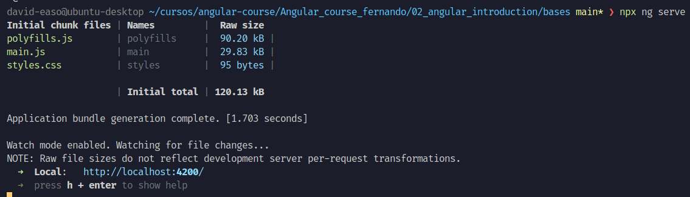

Vemos:

- vendor.js => son todos los paquetes de node que necesitamos
- runtime.js => lo q nos permite correr nuestra app
- polyfills.js => permite la compatibilidad entre navegadores

vemos cuanto pesa la app pero esto es previo al "tree shaking" que es el proceso de build optimizado para prod.


Para generar el build podemos usar los scripts de npm en el package.json `npm run build` que ejecutaria `ng build`

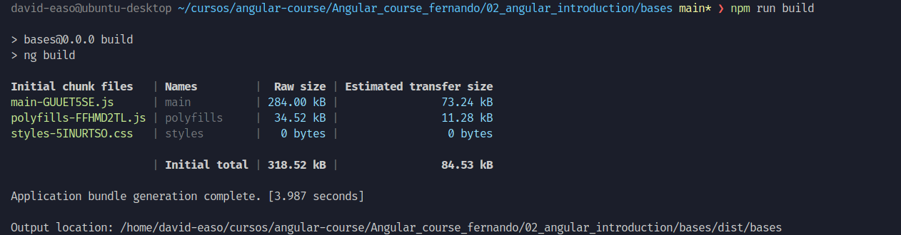

si nos fijamos los archivos que genera se les añade un `hash` por ejemplo `polyfills-FFHMD2TL.js` para evitar q el cache no actualice los cambios.

Esto genera un nuevo directorio llamado `dist` y dentro de este un directorio bases y dentro un `browser` el contenido del browser es lo q se tiene q subir al servidor para q podamos ver la web.

### deploy local

para ello podemos usar un paquete llamado `http-server` que nos permite montar un servidor en local capaz de servir static files sin configuraciones.
Cuando en web hablamos de static files nos referimos a archivos q no cambian, una vez hacemos el build de nuestra app en angular esos archivos no van a cambiar, es decir desde el backend no se van a crear nuevos archivos, por eso necesitamos un server q sirva los archivos de mi web. Solo con propósito de test. 
Nos situamos en el directorio `browser` dentro de dist y alli ejecutamos `http-server -o` y nos dara una ip dnd podemos consultar nuestra web como si estuviera en produccion

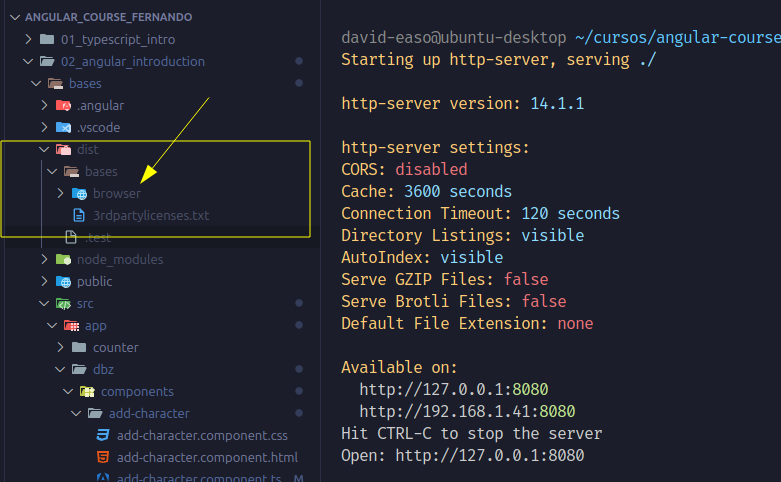

### Deploy en Netlifly

es un servicio que nos permite desplegar las aplicaciones.

Nos registramos y cuando entremos vamos a sites y alli subimos la carpeta `browser`

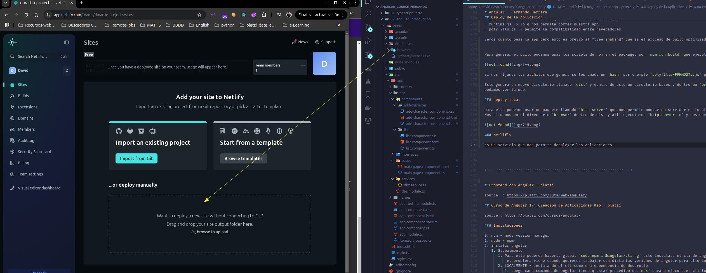

esto nos dara una URL dnd podremos ver nuestra web funcionando 

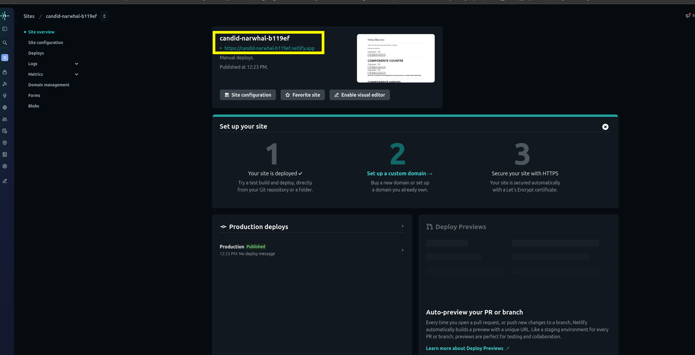

### Deploy en GitHub Pages

Para poderlo desplegar con pages podemos hacerlo desde una rama pero siempre tenemos q tener en la raiz de nuestro repo una carpeta llamada `docs` entonces copiamos el contenido de la carpeta de dist>bases>browser en la carpeta docs

tenemos que tenerlo asi

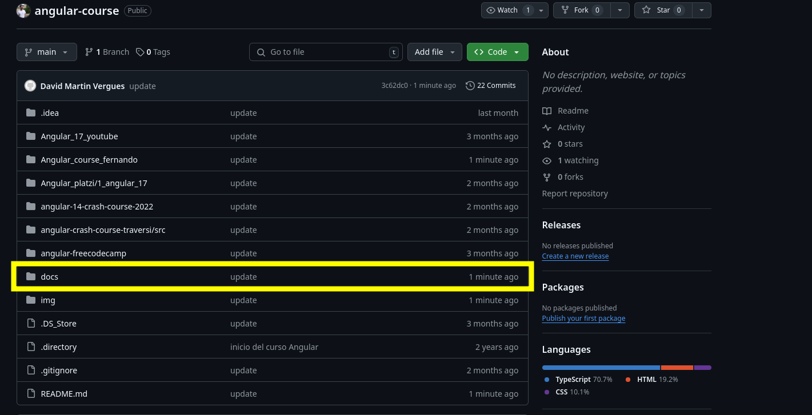

entramos en settings del repo vamos a pages y le decimos q use la rama q deseemos y vaya a docs

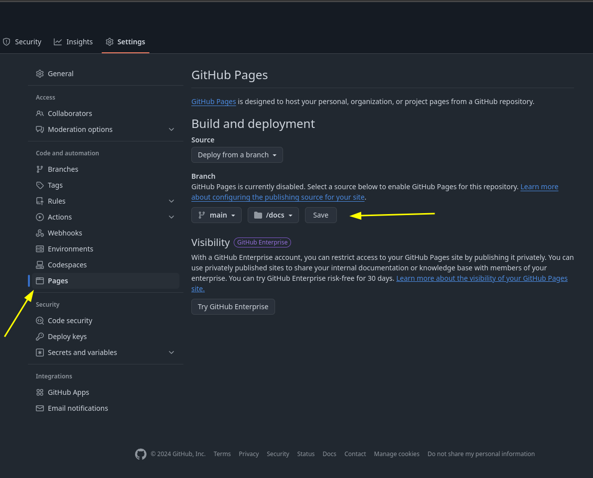

una vez termina el deploy vamos a actions y ahi nos dara la url dnd esta nuestra web

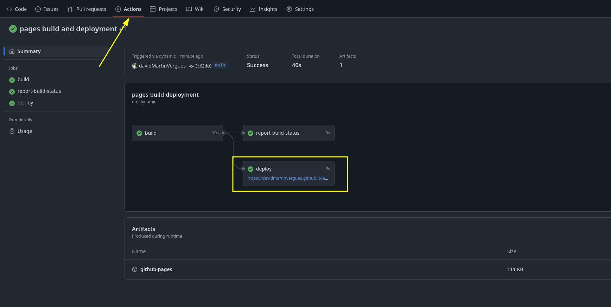


pero no veremos nada xq mi app busca los archivos en el root de la app pero github pages añade a este root el nombre de mi repo por eso no encuentra los archivos

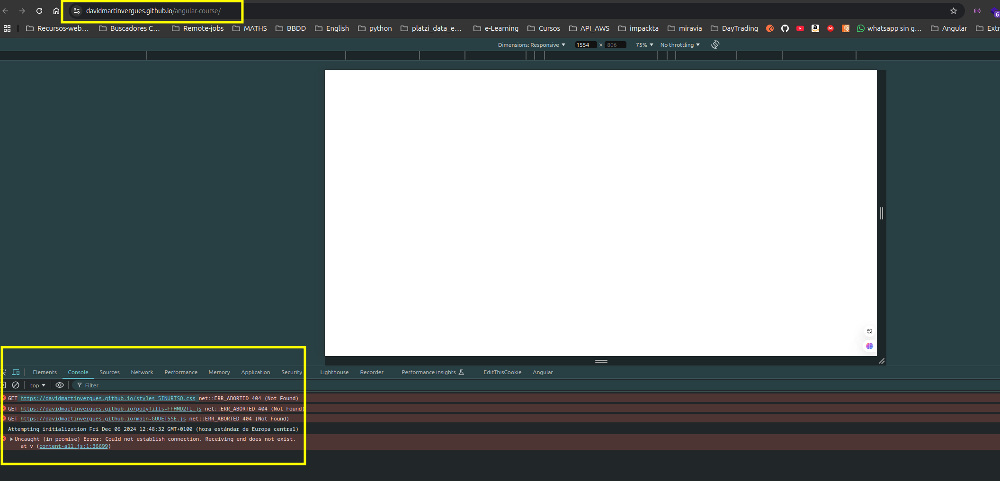

necesitamos entrar en el index.html de docs y añadir este nombre al path


<!-- ::::::::::::::::::::::::::::::::::::::::::::::::::::::::: -->


# Frontend con Angular - platzi

source  : https://platzi.com/ruta/web-angular/

## Curso de Angular 17: Creación de Aplicaciones Web - platzi

source : https://platzi.com/cursos/angular/

### Instalaciones

0. nvm - node version manager
1. node / npm
2. instalar angular
   1. Globalmente
      1. Para ello podemos hacerlo global `sudo npm i @angular/cli -g` esto instalara el cli de angular de manera global (globalmente solo puede haber un Angular-CLI) 
          el problema viene cuando queremos trabajar con distintas veriones de angular para ello instalaremos las verisones del CLI localmente 
      2. LOCALMENTE - instalando el cli como una dependencia de desarollo
         1. Luego cada comando de angular tiene q estar precedido de `npx` para q ejecute el cli local del proyecto (lo buscara en node_modules) por lo q nos debemos situar en la raíz del proyecto
            1. `npm install @angular/cli@17.0.0 --save-dev`

### Creacion de un proyecto

1. `npx ng new todoapp` (si no queremos incluir tests añadiremos el flag `--skip-tests`)
`
si lo hacemos instalando CLI localmente tendremos el siguiente esquema, en el directorio del proyecto un node_modules correspondiente al angular-cli instalado localmente y dentro de la applicacion en sí otro node_modules.

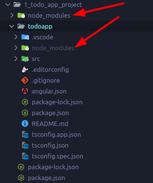

2. Finalmente para ejecutar el proyecto hacemos `npx ng serve` siempre desde la raiz o desde dnd se encuentra el `package.json` de nuestro proyecto. 

En el directorio `app` tendremos 3 archivos importantes:
  1. app.component.ts
  2. app.component.html
  3. app.component.css

### Componentes

Hasta ahora hemos trabajado en el comonente maestro q es el  `app.component`.

Ahora vamos a crear nuestros propios componentes (páginas) y todos ellos los guardaremos en una carpeta `pages`

`npx ng g component pages/home`
`npx ng g component pages/labs`

<!-- ::::::::::::::::::::::::::::::::::::::::::::::::::::::::: -->

# Angular freecodecamp Course

source: https://www.youtube.com/watch?v=3qBXWUpoPHo&t=26s


## Intro

Tenemos:
 AngularJS (hecho con puro JS) obsoleto
 Angular (hecho con TypeScript)

### SPA - Single Page Application

Los importante de las SPA es que hay una única request en la que se manda todo el html del sitio web, por lo que si queremos ir a distintas secciones de la página el html ya está en nuestro browser por lo q no tenemos q hacer más request al sitio y solo pediremos al server `datos` de tipo `json` mediante endpoints.

#### SPA y Angular

Angular es un framework especializado en crear aplicaciones SPA. Angular tiene un módulo llamado `routing` para crear SPAs que nos permitirá acceder a diferentes end-points para recuperar los datos que necesitamos. Sigue el sistema MVC (modelo vista controlador).
El modelo es una clase TypeScript.

Angular CLI (Angular Command Line interface) nos permite crear, desarrollar y administrar las aplicaciones de Angular

Para instalar el Angular cli hacemos:

```
npm install --global @angular/cli // instala la última version

npm uninstall -g @angular/cli// desinstala todas las versiones de anular cli que tengamos instaladas

npm i -g @angular/cli@16.2.10

```

## Primera app angular

```
ng new curso-angular-youtube
```
esto crea toda la estructura de carpetas de angular. Nos pregunta si queremos usar el `routing` de angular => le damos q sí y podremos escoger como sera los estilos (css, less, ...)

En el directorio `src` tenemos los directorios
- app 
  - routing
  - components
  - module
- assets (archivos static)
- index.html
- main.ts
- styke.css


## Arquitectura de una app Angular

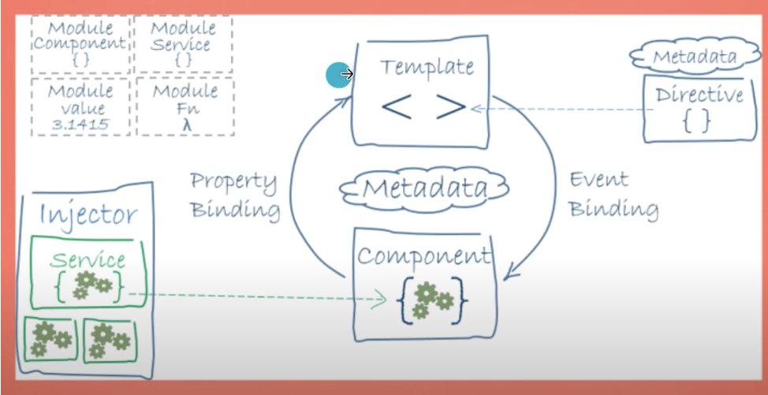

### Modulos

Es un mecanismo de organizacion y encapsulamineto que se utiliza para agrupar componentes,directivas, pipes(filtros),serviciosy otros elementos relacoinados en una unidad funcionalcoherente. Ayudan a dividir una aplicacoin en partes pequeñas y manejables, lo q facilita el desarrollo, la nabtenibilidad y la escalabilidad.

Los modulos siguen una organizacion jerarquica, el modulo principal pasa datos a los modulos q tiene por debajo y así, una esctructura en árbol. Por ejemplpo tenemos el modulo principal, despues tenemos un modulo pequeñito de login, el modulo q controla la cuenta corriente, el q gestiona las cryptos,... 

los modulo es una manera de organizar la app, no son elementos visuales, no se ven en el front. No son como los componentes, lo componentes se pintan en la pantalla, son elementos q se ven.

Para hacer un modulo nuevo:

```
ng generate module nombre-del-modulo

ng g m nombre-del-modulo
```
asi luce un modulo

```js
import { NgModule } from '@angular/core'; // importanmos el decorador para luego indicar q es un modulo
import { BrowserModule } from '@angular/platform-browser'; // modulo propio de angular

import { AppRoutingModule } from './app-routing.module'; // modulo propio de angular
import { AppComponent } from './app.component'; // un componente

@NgModule({
  declarations: [
    AppComponent
  ],
  imports: [
    BrowserModule,
    AppRoutingModule
  ],
  providers: [], 
  exports:[],
  bootstrap: [AppComponent] // no es la libreria XD es un atributo q angular lo llamo bootstrap y es dnd especificamos el componente principal de la app
})
export class AppModule { }

```
los modulos q ponenmos en el imports nos permitiran ampliar las funcionalidades de modulo q estoy creando

### Componentes

Es un bloque fundamental de construccion para la creacion de interfaces de usuario (UI) es una webapp.Los componentes son responsables de definir como se ve y se comporta una parte especifica de la interfaz de usuario. Xada componente representa un elemento visual o funcional de la web, como un encabezado, un pie de pagina, un formulario, una lista de elementos,...

Nos permite diseñar atomicamente, es decir creamos un componente q lo podremos reutilizar en distintos lugares de la app, son como ladrillitos para construir la parte visual de la app que tb le da funcionalidad, es decir definen vistas y logica.Son reactivos y se basan en TypeScript para hacer la logica y la vista se construye con html.
Se organizan en jerarquia.

para crear un componente

```
ng generate component nombre-del-component

ng g c nombre-del-componente
```

El componente se compone de 4 archivos (3 obligatorios):

- archivo del comonente (el controlador, es una clase TypeScript) => nombre-del-componente.component.ts
-  archivo html (es la plantilla, la vista) => nombre-del-componente.component.html
-  archivo css (estilos de la vista) => nombre-del-componente.component.css
-  archivo para hacer tests => nombre-del-componente.component.specs.ts (NO ES OBLIGATORIO)

```js
import { Component, OnInit } from '@angular/core';

@Component({
  selector: 'app-root', // el nombre q le damos al componente
  templateUrl: './app.component.html', // dnd se encuentra el html para ese componente
  styleUrls: ['./app.component.css'] // dnd encontramos los distintos estilos q puede tener el html
})
export class AppComponent implements OnInit {

  // propiedades del comopnente
  title:string = 'curso-angular-youtube';

  constructor(){}

  // metodos 

  ngOnInit():void{
    
  }
}

```
con la notacion de " {{ }} " nos permite renderizar en la vista una variable de manera dinamica
```html

<div>
  <h1>{{ title }}</h1>
  <p> Esta parte del html es estatico</p>
</div>
```
archivo de estilos

```css

div{

color:blue;
}

p{
  color:red;
}
```
Este componente `app-root` lo podremos insertar en el index.html para q se renderice.

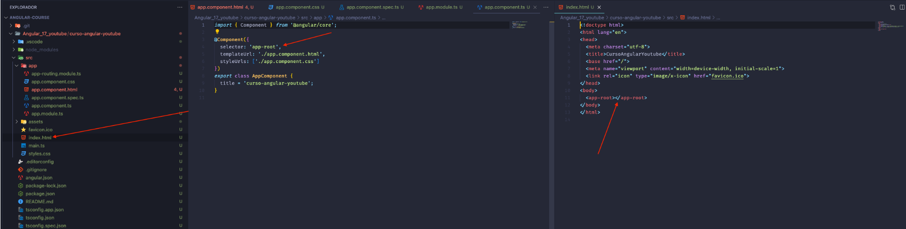


## Creando nuestro primer componente

1. creamos el componente por comando
```
ng g c componente-padre
```

2. esto crea una carpeta del mismo nombre q el componente con los siguientes archivos

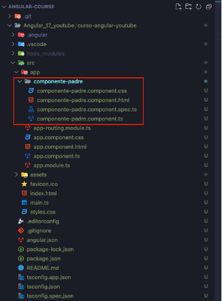

3. en cuanto creamos el componente este se añade al modulo principal (app.module) directamente

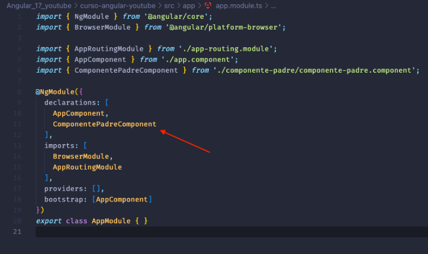


4. este componente padre vive dentro del componente principal q es `app.complonent.ts ` por lo q el nuevo componente lo tenemos q llamar dentro del html de este utilizando el selector de su archivo .ts

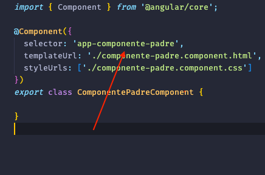

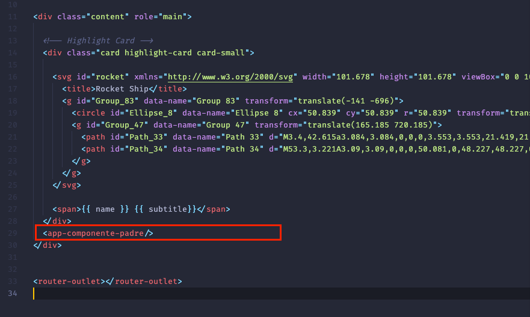


## Data binding (enlace de datos)

Es la capacidad de conectar y sincronizar automaticamente los datos entre el modelo (estado de la aplicacion) y la vista (interfaz de usuario) Esto permite q los cambios en el modelo se reflejen automaticamente en la vista y viceversa.

Por ejemplo

en mi clase TS

```js
import { Component } from '@angular/core';

@Component({
  selector: 'app-contador',
  templateUrl: './contador.component.html',
  styleUrls: ['./contador.component.css']
})
export class ContadorComponent {

  valorContador : number = 0;

  incrementar(){
    this.valorContador++
  }

  decrementar(){
    this.valorContador--
  }

}
```

en mi html 

```html
<p>contador works!</p>

<h1>{{valorContador }}</h1>

<button (click)="incrementar()" >Incrementar</button>
<button (click)="decrementar()" >Decrementar</button>

```

esto me permite tener un contador  q sin actualizar la pantalla me actualice el valor del contador cuando hago click sobre el boton.

## Envío de datos entre los componentes

Un componente puede enviar datos hacia arriba (componente q lo contiene) o hacia abajo (componente/s q contien)

Se pueden comunicar a traves de las input/output properties. Un componente hijo puede llevar datos al padre mediante q generacion de un evento y el padre puede pasar datos al hijo mediante input data binding.

### Características principales

- conexión automática: sincroniza datos entre modelo y l avista
- unidireccional: los cambios en el modelo se reflejan en la vista
- bidireccional: los cambios en la vista se reflejan en el modelo
- reactivo: utiliza **observable** para actualizaciones en tiempo real
- simplifica interacciones
- automatiza actualizaciones

Hay distintos modos de pasar datos entre controlador(component.ts) y l vista (component.html)

1. del controlador a la vista
   1. usando notacion {{value}}
   2. usando propiedades clave-valor ([property]='value)
2. de la vista al controlador
   1. Usando eventos (event => handler)
3. intercambio vidireccional
   1. usando ng-models ([(ng-model)] = 'property')

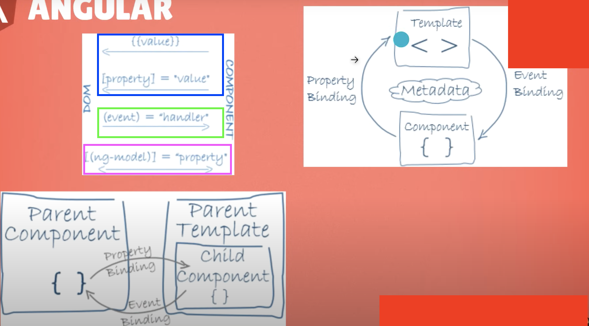


### Metadata

Se refiere a la información adicional que se proporciona mediante `decoradores` en las clases q definen componentes,módulos, servicos y otras parates de la app, se utilizar para `configurar` y `personalizar` el comportamiento de estos elementos.

por ejemplo el contenido del objeto q le pasamos a `@Component` es la metadata.

```javascript
@Component({
  selector: 'app-contador',
  templateUrl: './contador.component.html',
  styleUrls: ['./contador.component.css']
})
```


### INPUT 

1. en el **componente hijo**, se puede definir propiedades de entrada utilizando el decorador ` @input()` son datos q envía el componente padre y el hijo los captura.
```javascript
// componente hijo ().component.ts)

@Input() datoEntrada: string;
```

2. En el **componente padre** puedes vincular datos a la propiedad de entrada del componente hijoutilizando sintaxis de corchetes [] en el marcado del template

```html
<!-- componente padre (html)-->

<app-hijo [datoEntrada]='valorDesdePadre'></app-hijo>

```

3. si los datos del componente padre q envía al hijo cambian esto se actualiza directamente en el hijo

```javascript
// componente padre

valorDesdePadre = 'Hola mundo!';
```
4. finalmente, esa propiedad q viaje del padre al hijo puede ser usada en el hijo comom queramos (usarla en la logica, renderizarla en la plantilla, etc...)

```html

<!-- componente hijo template -->

<p> {{ datoEntrada }}</p>
```

### OUTPUT y EventEmitter

1. se utiliza para conseguir la comunicacion entre un componente hijo y su padre, para ello se declara una propiedad con el decorador `@output` en el componente hijo

```javascript

//componente hijo
import { Output,EventEmitter} from '@angular/core';
@output() messageEvent = new EventEmitter<string>();

message: string = '';

sendMessage(){
  this.messageEvent.emit(this.message);
}

```
hay q importar forms en el `app.module.ts` ya que para usar `ngModel` y vincular esa propiedad cn el valor de un input necesitamos tratarlo como un formulario.

```javascript

import { FormsModule} from '@angular/forms';

@NgModule({
  declarations: [
    AppComponent,
    PadreComponent,
    HijoComponent,
    ContadorComponent,
    OutputsComponent,
    OutputsPadreComponent
  ],
  imports: [
    BrowserModule,
    AppRoutingModule,
    FormsModule
  ],
  providers: [],
  bootstrap: [AppComponent]
})
export class AppModule { }

```
2. en el html del hijo se utiliza `ngModel` para vincular datos de esta vista con la propiedad del ts en este caso `message`.

```html

<!-- componente hijo template -->

<div>
  <label for='childInput'>Mensaje:</label>
  <input id='childInput' [(ngModel)]='message'/>
  <button (click)='sendMessage()'>enviar mensaje</button>

</div>

```

3. en el ts del padre definimos una propiedad q es la q recibira el valor q emitimos desde el hijo y una vez  capturado  este evento q dispara una funcion q actualiza este valor

```javascript

// component ts del padre 

export class OutputsPadreComponent {

  receivedMEssage : string = '';

  receiveMessage(message:string){
    this.receivedMEssage = message
  }

}

``` 
4. finalmente en el template del padre cargamos el hijo y escuchamos el evento q emite el hijo para capturarlo y ejecutar la funcion del padre

```html

<p>child says: {{ receivedMEssage}}</p>

<app-outputs  (messageEvent)=receiveMessage($event) />
```

## Servicios

### Caracteristivas

  1. Reutilizacoin: logica compartida
  2. Separacion de preocupaciones: divide logica y UI
  3. Inyeccion de dependencias: instancias proporcionxadas
  4. Centralizacion de datos: alamcena y gestiona datos compartidos (prescindiendo de un backend, podemos guardar los datos en un servicio para poderla pasar entre componentes)
  5. comunicacion entre componentes
  6. lifecycle independiente: no vinculado a vistas
  7. testeabilidad: facil de probar

Es una clase de TypeScript que se utilizan para organizar y compartir lógica, datos o funcionalidades comunes entre diferentes componentes. Permite centralizar y reutilizar logica q no esta directamente relacionada con la interfaz de usuario.

Para asi decirlo es un modo de compartir una lógica concreta entre distintos componentes, (evita repetir lógica)

Los servicios se inyectan en los componentes.

para generar un servicio desde el angular-cli

```
ng g s nombre_servicio
```
y se utiliza el decorator ` @Injectable` 

son utilies xq ejemplo para "persistir" los datos del usuario entre pantallas de la applicacion, podemos poder nombre, direccion, etc etc del usuario en un servicio 

### Servicios y dependencias

Las dependencias son los recursos externos y modulos de codigo q una app necesita para funcionar correctamente. Estos recursos pueden incluir bibliotecas externas, modulos angular, servicios personalizados, componentes,...
Las dependencias en angular se gestionan a través del sistema de inyeccion de dependencias.

Para inyectar un servicio antes de Angular 16 se hacia como parámetro en el constructor

```js
import { Component } from '@angular/core';
import { ServicioFamiliarService } from '../servicio-familiar.service';

@Component({
  selector: 'app-padre',
  templateUrl: './padre.component.html',
  styleUrls: ['./padre.component.css']
})
export class PadreComponent {

  constructor(private service: ServicioFamiliarService){}

}
```

a partir de angular 15 se hace asi, usando ` inject`

```javascript
@Component({
  selector: 'app-hermano',
  templateUrl: './hermano.component.html',
  styleUrls: ['./hermano.component.css']
})
export class HermanoComponent implements OnInit{
  
  nombre?:string;

  constructor(){}
  

  private service = inject(ServicioFamiliarService)

}
```
este es el servicio

```js
import { Injectable } from '@angular/core';

@Injectable({
  providedIn: 'root'
})
export class ServicioFamiliarService {

  hermano_grande : string = 'Juan';
  hermano_pequeno : string = 'Pedro';

  saludar(hermano: string){
    console.log(`Hola ${hermano}`)
  }

  preguntar_por_hijo():string{
    return 'cómo esta tu hijo?'
  }

  constructor() { }
}
```


## Directivas

Son instrucciones en el marcado HTML que proporcionan funcionalidad adicional a los elementos DOM existentes o personalizan su comportamiento. Las directivas son un componente clave en la construccion de Angular web apps ya q permiten extender y manipular el DOM de manera declarativa, l q facilita la creacion de interfaces de usuario dinamicas e interactivas. Angular proporciona varias directivas incorporadas y también permite la creación de otras personalizadas. 

### Caracteristicas

1. Instrucciones HTML, extienden o personalizan elementos HTML
2. Directivas incorporadas, ofrecen funcionalidades predefinidas
3. Directivas estructurales, manipulan la estructura delDOM
4. Directivas de atributos, cambian atributos y propiedades
5. Directivas de eventos, capturan y responden a eventos de usuario
6. Ditectivas personalizadas, creadas para necesidades especificas
7. Flexibilidad de aplicación, se pueden aplicar como atributos o elementos

creacion de directiva personalizada, las prehechas ya se cargan en el core de angular

```
ng g d nombre-directiva

```

para llamar a una directiva en nuestro HTML 

```html

<div miDirectiva>
  este es un elemento  con mi directiva
</dic>

```

las directivas se escriben asi

```javascript
import { Directive, ElementRef } from '@angular/core';

@Directive({
  selector: '[appEstiloHermanos]'
})
export class EstiloHermanosDirective {

  constructor( private element : ElementRef) { 
    this.element.nativeElement.style.textTransform = 'capitalize'


  }
}
```

Hemos puesto de ejemplo la mdificacion de estilos pero se puede utilizar xa muchas otras cosas mas


## PIPES

[link a las pipes de angular](https://angular.io/guide/pipes)

Permite formatear y transformar datos en la vista de una aplicacion web de manera sencilla y legible, los pipes son funciones q toman un valor de entrada, por ejemplo un stirng, number, fechas,... y lo procesan para proporcionar una representacion formateada en la interfaz de usuario. Solo es visual! no modifica el dato original.

Los PIPES se utilizan en los archivos HTML y se aplican utilizando la barra  ` | `

Angular proporciona pipes integrados como DatePipe, UpperCasePipe, ...aunq tambien puedes crear tus propios pipes.

para ello 

```
ng g p nombre-del-pipe
```

un pipe de ejemplo

```javascript
import { Pipe, PipeTransform } from '@angular/core';

@Pipe({
  name: 'miPipePersonalizado'
})
export class MiPipePersonalizadoPipe implements PipeTransform {

  transform(value: string | undefined): string {
    return value?.toUpperCase() || '';
  }

}
```

### Agregar bootstrap en Angular.

Tenemos q instalar bootstrap con 

```
npm i bootstrap@5.3.2
```

y despues coger la ruta relativa del `bootstrap.min.css` y del `bootstrap.bundle.min.js` dentro de node_modelules>dist> y copiarlo en el archivo ` angular.json` en la seccion de `build`


```javascript
"build": {
  "builder": "@angular-devkit/build-angular:browser",
  "options": {
    "outputPath": "dist/landing-page",
    "index": "src/index.html",
    "main": "src/main.ts",
    "polyfills": [
      "zone.js"
    ],
    "tsConfig": "tsconfig.app.json",
    "assets": [
      "src/favicon.ico",
      "src/assets"
    ],
    "styles": [
      "src/styles.css",
      "node_modules/bootstrap/dist/css/bootstrap.min.css"
    ],
    "scripts": [
      "node_modules/bootstrap/dist/js/bootstrap.bundle.min.js",
      "node_modules/jquery/dist/jquery.min.js"

      
    ]
```


## Routing o Enrutamiento

El enrutamiento en Angular se refiere a la capacidad de navegar entre diferentes componentes o vistas de una aplicacion web sin recargar la pagina completa. Permite crear SPA dnd los cambios en la url desencadenan la carga de diferentes componentes.

Las rutas definen la correspondencia entre la URL y los componentes q deben cargarse cuando esa URL esta activa. Se configura en un array dentro del modulo de la app.

```javascript
const routes: Routes = [
  {path: 'inicio', component: InicioComponent}
]
```
La directiva ` router-outlet ` se utiliza en la plantilla para indicar el lugar dnd Angular debe cargar dinamicamente los componentes asociados a las rutas. Puede haber un router-outlet en cada modulo.

Para navegar podemos utilizar directiva routerLink en links ` <a routerLink='/inicio'>Inicio</a>, botones o programaticamente usando el servicio router de angular. Podemos enviar propiedades junto con el link 

```javascript
{path: 'producto/:id', component: DetalleProductoComponent}

<a [routerLink]="[ '/producto', producto.id]">Ver detalles</a>
```
antes habia la opción de ` routerLinkActive` , servia para activar la opcion del menu al enrutar con angular, mediante la asociacion con una clase css. Aunq actualmente se utiliza la directiva `ngClass`

Para pasar mas de un parametro por URL para ello:

```javascript
// app-routing.module.ts
{path: 'producto/:categoria/:id', component: DetalleProductoComponent}
// xxx.componen.html
<a [routerLink]="[ '/producto', producto.categoria, producto.id]">Ver detalles</a>

```

para capturar ambos parametros en el .TS `ActivatedRoute` o ` Router`.

```javascript
import { Component, OnInit } from '@angular/core';
import { ActivatedRoute } from '@angular/router';

@Component({
  selector: 'app-products-detail',
  templateUrl: './products-detail.component.html',
  styleUrls: ['./products-detail.component.css']
})
export class ProductsDetailComponent implements OnInit{

  product: string = '';
  color:string='';

  constructor( private _route: ActivatedRoute){}

  ngOnInit(): void {
    this._route.params.subscribe(params => {
      this.product = params['productId'];
      this.color = params['style'];
      
    })
  }

}


}

```

y en la vista podemos pintar los datos del siguiente modo

```html
<h1>Detalle del producto</h1>
<h3 [ngStyle]="{'color': color}">{{product}}</h3>
```
## Estructuras de Control

Son herramientas que te permiten manipular el flujo de ejecucion en tu aplicacion.

Hay varios tipos

### ngIf

permite mostrar u ocultar un elemento en funcion de una expresion booleana

```javascript
<div *ngIf="mostrarElemento">
    contenido se hace visible si mostrarElemento se resuelve como true
</div>
```

### ngFor

obviamente iterar sobre una lista

```javascript
<ul>
    <li *ngFor="let item of items">
        {{item}}
    </li>
</ul>
```
### ngSwitch

```javascript
<div [ngSwitch]="option">
    <p *ngSwitchCase="'option1'"></p>
    <p *ngSwitchCase="'option2'"></p>
    <p *ngSwitchCase="'option3'"></p>
    <p *ngSwitchDefault> Contenido por defecto </p>
</div>
```

### ngClass

Permite cambiar dinamicamente las clases de un elemento

```javascript
  <div [ngClass]="{'class1': condicion1, 'class2': condicion2}">
    contenido con clase dinamica
  </div>
```
### ngStyle

Permite cambiar dinamicamnete los estilos de un elemento

```javascript
<div [ngStyle]="{'property': expression}"></div>
```

### ngContainer

Es una estructura de control q no afecta al DOM, se utiliza para agrupar elementos sin agregar nodos adicionales al arbil DOM

```javascript
  <ng-container *ngIf="expression">
    contenido q no afecta al DOM directamente
  </ng-container>
  
```


# Intro to TypeScript

- Es un lenguaje fuertemente tipado, necesitas declarar qué tipo de dato contendrá la variable

### crear TS app

1. install node
2. `npm init`, creará un package.json
3. install TS `npm install typescript@latest`
4. inicializar TS `tsc --init`
5. escribes tu código TS
6. compilas el código con el comando `tsc`, ejecutarlo dnd esté el archivo tsconfig.json
7. una vez compilar para hacer run de tu archivo podemos usar node en local `node yourfile`o ejecutarlo en browser.

Después de compiar el programa en TS se genera un archivo con el mismo nombre pero con extensión `.js`

El último comando nos creará un archivo `tsconfig.json` donde especificaremos parámetros para typeScript.

si el comando `tsc `no funciona podems probar con:

```javascript
npx --package typescript tsc --init
npx --package typescript tsc
```

o ya como útimo recurso localizar en node_modules dnd está instalado el archivo `tsc` y poner toda la ruta:

```
/home/david-easo/cursos/angular-course/angular-freecodecamp/TypeScript-refresh/node_modules/typescript/bin/tsc --init
```

### Data types 

1. string
2. number
3. boolean
4. array
5. enum
6. tuple
7. any
8. void
9. never

ir al archivo "1-data-types.ts"

### Functions

ir al archivo "2-functions.ts"

### Classes

En JS hay clases desde ES6, para usar clases con TS debemos modificar, en el archivo `tsconfig.json`, el apartado `target: ES5` ya q no todos lps browser soportarán esa sintaxis

para mantener las properties como privadas podemos usar `#` o private (pero este último está deprecated)

ir al archivo "3-classes.ts"

### Interfaces

se usan para definir el "molde" para una clase.

ir al archivo "4-interfaces.ts"

### Modules

Para poder utilizar objetos fuera de sus archivos dnd se han definido utilizamos la keyword `export`

```javascript
export interface User {
    name: string;
    age?: number;
    id: number;
    email: string;
}
```

i para usarlo en otro lugar hacemos un import indicando la ruta del archivo dnd se encuentra el export pero sin la extensión del archivo

```javascript
import {User} from "./interface";
```
otra manera ya obsoleta es usando `* ` y un alias

```javascript
import * as login from "./interface";

login.User
```

### Object deconstruction


---
---
---

# Angular crash course

## What is angular?

Frontend javascript frameowrk. Angular is an app design framework and development platform for creating efficient single-page apps.

The most used stack is on MEAN (Mongo express angular).

Angular is based on components. Components in angular includes:

1. template (HTML)
2. Logic (JS or TS)
3. Styling(css/scss/sass/less)

```javascript
@Component({
    selector: 'app-hero-list', //it will be placed into a tag
    templateUrl: './hero-lis.component.html',
    providers : [HeroService]
}) 

export class HeroListComponent implements OnInit{
    /* your code */
}
```
Components are reusable and can be embedded into the template as an XML-Like tag.

### Angular Services

Angular distinguishes components from services to increase modularity and reusability.

A component can delegate certain tasks to services, such as fetching data from server, validationg user input or logging directly to the console.

### Angular CLI

Standard tooling for angular development.

We need to install it at first 

```
npm install -g @angular/cli
```

It will allow us create:

- angular apps (`ng new my-angular-app`)
- Dev server and easy productions build 
- Commands to generate components, services,...

## Why angular?

* Create dynamic Frontend apps
* Full featured framework (router,http,...).
* Integrated TypeScript (optional, it is not mandatory to know TS to start with angular)
* RxJS - efficient, asynchronous programming
* Test-friendly


## Creating Angular app 

1. `ng new my-angular-app` - follow the steps
   
2. `ng serve` - run dev server on localhost:4200

   1. `ng serve -o` - abre el proyecto en el navegador x defecto
   2. `ng serve -o --port=3500 ` - abre el proyecto en un puerto concreto

3. `ng version` dentro de nuestro proyecto nos dará info de las dependencias q está usando angular

```
Package                         Version
---------------------------------------------------------
@angular-devkit/architect       0.1303.1
@angular-devkit/build-angular   13.3.1
@angular-devkit/core            13.3.1
@angular-devkit/schematics      13.3.1
@schematics/angular             13.3.1
rxjs                            7.5.5
typescript                      4.6.3
```

### Estructura del proyecto

1. `src` 

en este directorio está el código de nuestra app (componentes,servicios, routers, style,...)

2. `.browserlistrc`

Dnd se indican los browser en los que tiene que correr nuestra app, a que navegadores tiene que dar soporte.

3. `.editorconfig`

Fija las reglas de styling que tendrá nuestro editor de código para q todos los del equipo trabajen igual, por ejemplo si trabajamos con tabuladores o espacios, cuantos espacios es un tabulador, que charset usará el proyecto (UTF-8),etc 

PAra que este archivo funcione con vscode necesitamnos bajar una extensión (editorconfig for vscode).

4. `tsconfig.json`

Como se configura angular para trabajar con typescript. Por defecto Angular trabaja con TS. Este archivo nos especifica cómo va a compilar, dónde va a transpirar los archivos, versión de JS q utilizaremos, modificar el comportamiento del compilador de angular, etc...

5. `angular.json`

Vamos a configurar diferentes ambientes, por ejemplo el ambiente de staging (ambiente de pruebas antes de salir a producción), ambiente para QA, etc...

6. `karma.conf.js`

Para correr pruebas unitarias.

7. `package.json`
Lo crea node.
dnd se especificas las dependencias del proyecto, veriones, nuestros scripts

8. `.nvmrc`

Este archivo lo creamos nosotros en la raíz del proyecto. Nos permite utilizar el `node version manager` que nos recomendará la versión más adecuada de node para trabajar con nuestro proyecto. 

Sirve para q todo el equipo trabaje con la misma versión de node. Básicamente es un archivo dnd especificamos la versión de node que estamos usando para desarrollar el proyecto 

```javascript
//contenido del archivo .nvmrc
v16.14.0
```

9.  on `index.html`, specificatly on our app-root component 

```html
<!doctype html>
<html lang="en">
<head>
  <meta charset="utf-8">
  <title>AngularCrashCourse</title>
  <base href="/">
  <meta name="viewport" content="width=device-width, initial-scale=1">
  <link rel="icon" type="image/x-icon" href="favicon.ico">
</head>
<body>
  <app-root></app-root>
</body>
</html>
```

En el tag app-root se renderiza nuestro componente base q es `app.component.html`. Podemos sustituir su contenido con el home page de nuestra app.

### Crear un nuevo componente utilizando angular/cli

```
ng generate component components/social-media-share-buttons
```

### Conceptos básicos de TS 

1. Básicamente TS permite escribir JS añadiendo tipado de las variables. Aunque no es obligado usarlo

```javascript
const username: string | number = 'dmv';
```
Fijar el tipado es importante pej en funciones 

```javascript
const suma = (a: number, b: number) => {
  return a + b;
};

```

gracias a TS el editor nos puede avisar si le pasamos un tipo de dato erróneo a esa función.

```javascript
suma(1, 'a'); // nos salta un error antes de ir al browser
```

2. trabaja con paradigma OOP 

podemos fijar tipos y poder especificar variables privadas dentro de la clase

```javascript
class Persona {
  
  private age: number;
  lastName: string;

  constructor(age: number, lastName: string) {
    this.age = age;
    this.lastName = lastName;
  }
}

const dmv = new Persona(37, 'dmv');
```

TS simplifica la declaración de clases

```javascript
class Persona2 {

  constructor(private age: number, public lastName: string) {}
}

const dmv2 = new Persona(37, 'dmv');
```

### Componentes de angular

Angular divide las responsabilidades del componente como hemos visto antes. 
La lógica se escibe en TS y el render lo hace el archivo html.

la estructura de un componente vacío es 

```javascript

import { Component, OnInit } from '@angular/core';

@Component({
  selector: 'app-header',
  templateUrl: './header.component.html',
  styleUrls: ['./header.component.css']
})
export class HeaderComponent implements OnInit {

  constructor() { }

  ngOnInit(): void {
  }

}
```

Hay un par de cosas a destacar :

- **CONSTRUCTOR** 

Funciona cuando inicializamos un nuevo objeto en este caso un nuevo comopnente. 

- **ngOnInit()**

Es un método para el ciclo de vida del componente. Es el método que usaremos habitualmente cuando inicialicemos nuetsro código por ejemplo si queremos indicar cuándo se carga nuestro componente lo indicaríamos en este método o si queremos hacer una petición `http` también iría en este método. 

El component .ts tiene un decorator que le dice qué html está ligado qué selector (tag) usará y qué archivo de styling 

```javascript
import { Component } from '@angular/core';

@Component({
  selector: 'app-root',
  templateUrl: './app.component.html',
  styleUrls: ['./app.component.css'],
})
export class AppComponent {
  public name = 'david';
   age = 37;
    img =
    'https://images.prismic.io/mystique/983eac5a-23be-4b1f-af1c-791d6931f760_IMG_1.jpg?auto=compress%2Cformat&w=1350&q=75&fit=crop&ar=3%3A1&fm=pjpg&exp=-10';

    names: string[] | number[] = ['david', 'marc', 'julian']; //acepted
    names: string[] | number[] = [1,2,3,4]; //acepted
    names: string[] | number[] = [1,'david']; //not accepted
    
}
```

Como vemos en decorator el selector apunta a `app-root` esto o que hace es meter el componente en la etiqueta app-root del index.html (es dnd empieza la app)

```html
<!-- index.html -->
<!doctype html>
<html lang="en">
<head>
  <meta charset="utf-8">
  <title>AngularCrashCourse</title>
  <base href="/">
  <meta name="viewport" content="width=device-width, initial-scale=1">
  <link rel="icon" type="image/x-icon" href="favicon.ico">
</head>
<body>
  <app-root></app-root>
</body>
</html>


```

Una cosa importante a tener en cuenta que las variables declaradas deben tener acceso público, si las declaro como privadas el html del componente no puede acceder. Por defecto es público no hace falta especificar `public`

### Decorator @Input()

Esto nos permite enviar props (propiedades desde la tag del componente al component.ts) Desde el componente madre donde se encuentra el tag de nuestro componet.

```html
<!--  ******* header component ******  -->
<header>
    <h1>{{ title}}</h1>
    <app-button color="green" text="Add2"></app-button>
</header>

```
Añado propiedades al tag de mi componente y las recibo en el component.ts. Para ello debo utulizar el decorador `@Input`

```javascript
import { Component, OnInit, Input } from '@angular/core';
export class ButtonComponent implements OnInit {

  @Input() text: string
  @Input() color!: string

  constructor() {

    this.text = 'Add'

  }

  ngOnInit(): void {
  }

}

```
TS se asegura siempre que esa propiedad exista, entonces puede ser q desde el tag no enviemos la propiedad `text` por eso nos obliga a hacer una de las dos cosas siguientes: 

1. añadimos al final del nombre de la variable un signo de admiraicón `!` esto indica a TS q **seguro** enviaremos esa propiedad  (lo q hago con color), la otra opción es ponerle un interrogante `?` indicando q esa propiedad será opcional 
   
```javascript
  @Input() color?: string

```


1. Inicializo esa variable en el constructor, con un valor por defecto y en caso q desde el tag del componente no le envie la propiedad utilizará este valor por defecto

La estrategia de esto es q puedo tener un componente button que según las props que le pase puedo modificarlo ligeramente, en mi caso le paso las props de texto y color del button

### Decorator @Output()

Este decorador nos servirá para que nuestro componente (en nuestro caso un button) emita un evento. Este evento podrá ser capturado por otro componente por ejemplo el componente madre header

Tenemos q importar Output y EventEmitter 

```html
<button 
  (click)="onClick($event)"
  [ngStyle]="{ 'background-color': color }"
  class="btn"
  >
    {{text}}
</button>

```
Añadimos un evento `click` a nuestro botón y cuando se active ejecute la función `onClick` que ésta a su vez lanzará un evento propio llamado `btnClick`. Para poder emitir ese evento usamos `@Output` para inicializar una variable `btnClick` q será un `EventEmitter`.


```javascript
import { Component, OnInit, Input, Output, EventEmitter } from '@angular/core';

export class ButtonComponent implements OnInit {

  @Input() text: string
  @Input() color!: string

  @Output() btnClick = new EventEmitter(); // el evento

  constructor() {this.text = 'Add'}

  ngOnInit(): void {}

  onClick(event: Event) {
    
    event.preventDefault()

    this.btnClick.emit()

  }

}

```

Ese evento emitido será capturado en el componente madre (header) para ello 
```html
<header>
    <h1>{{ title}}</h1>
    <app-button 
      color="green"
      text="Add2"
      (btnClick)="toggleAddTask()">
    </app-button>
</header>

```


### Directives

#### ngStyle

Esta directiva la podemos agregar en un tag para modificar el css inline. En el ejemplo del botton le paso la props color para q este surja efecto debemos utilizar la directiva de ngStyle

```html

<button 
  [ngStyle]="{ 'background-color': color }"
  class="btn"
  >
   {{text}}
</button>


```


### String Interpolation 

Lo usamos para q se renderice directamente en el html.
Es la manera que podemos pasarle datos a nuestros componentes. Para ello usamos las dobles llaves `{{ tus datos }}`

```html
<h1>Hello world</h1>
<h2>{{ 'Hola dmv'.repeat(2) }}</h2>

<h3>3+3={{3+3}}</h3>
```
Para traer variables declaradas en el componente usamos tb string interpolation 

```html
<h1>Hello world</h1>
<h2>{{ 'Hola dmv'.repeat(2) }}</h2>

<h3>3+3={{3+3}}</h3>

<h3>Hola! soy {{name}} y tengo {{age}} años</h3>


```

### Property Binding 

Manera que podemos modificar atributos de elementos de html desde el controlador, pej modificar el src de una images, etc...

```javascript
import { Component } from '@angular/core';

@Component({
  selector: 'app-root',
  templateUrl: './app.component.html',
  styleUrls: ['./app.component.css'],
})
export class AppComponent {

  public name = 'david';
  age = 37;
  img =
    'https://images.prismic.io/mystique/983eac5a-23be-4b1f-af1c-791d6931f760_IMG_1.jpg?auto=compress%2Cformat&w=1350&q=75&fit=crop&ar=3%3A1&fm=pjpg&exp=-10';

  btnDisabled = true;

  person = {
    name: 'dmv',
    age: 66,
    avatar:
      'https://images.prismic.io/mystique/983eac5a-23be-4b1f-af1c-791d6931f760_IMG_1.jpg?auto=compress%2Cformat&w=1350&q=75&fit=crop&ar=3%3A1&fm=pjpg&exp=-10',
  };

  toggleBtn() {
    this.btnDisabled = this.btnDisabled ? false : true;
    //this.btnDisabled =!this.btnDisabled;
  }

  age_plus() {
    this.person.age++;
  }
  miScroll(event: Event) {
    const element = event.target as HTMLElement;
    console.log(element.scrollTop); // en que posición está el scroll
  }

  myKeyup(event: Event) {
    const element = event.target as HTMLInputElement;
    this.person.name = element.value;
  }
}
```

```html
<button [disabled]="btnDisabled">Enviar</button>

<input type="text" [value]="name">

<progress max="100" [value]="age" ></progress>


```

si queremos acceder a las propiedades contenidas en un objeto lo hacemos con la notación del punto. 

```html
<input type="text" [value]="person.name">
<progress max="100" [value]="person.age" ></progress>

```

### Event Binding

1. click event 
   
Podemos capturar eventos, pej de boton

```html
<h1>Event binding</h1>

<button [disabled]="btnDisabled">Enviar</button><br><br>
<button (click)="toggleBtn()" >Toggle Buton</button>

<p>{{person.age}}</p>
<button (click)="age_plus()">age++</button>
```

```javascript
export class AppComponent {
  public name = 'david';

  btnDisabled = true;

  toggleBtn() {
    this.btnDisabled = !this.btnDisabled;
    //this.btnDisabled = this.btnDisabled ? false : true;
  }
    age_plus() {
    this.person.age++;
  }
}
 
```

2. scroll event

```html
<div class="box" (scroll)="miScroll($event)">
  <p>Lorem ipsum dolor sit amet consectetur adipisicing elit. Hic, id, debitis</p>
</div>

```

```javascript
export class AppComponent {

  public name = 'david';
  
  miScroll(event: Event) {
    const element = event.target as HTMLElement;
    console.log(element.scrollTop); // en que posición está el scroll
  }
}
 
```
leemos el evento ocurrido en un elemento HTML, en este caso el evento scroll del <p>


```html
<div class="box" (scroll)="miScroll($event)">
  <p>Lorem ipsum dolor sit amet consectetur adipisicing elit. Hic, id, debitis numquam provident unde exercitationem recusandae laboriosam nesciunt modi ipsam optio, ullam quae fugiat molestias </p>
</div>
```

3. keyup event

```html
<p>tu nombre:{{person.name}}</p>
<input type="text" (keyup)="myKeyup($event)">
```

```javascript
export class AppComponent {

person = {
    name: 'dmv',
    age: 66,
    avatar:
      'https://images.prismic.io/mystique/983eac5a-23be-4b1f-af1c-791d6931f760_IMG_1.jpg?auto=compress%2Cformat&w=1350&q=75&fit=crop&ar=3%3A1&fm=pjpg&exp=-10',
  };


  myKeyup(event: Event) {
    const element = event.target as HTMLInputElement;
    this.person.name = element.value;
  }
}

```

Tenemos más eventos que se pueden consultar aquí : [events guide](https://www.eduforbetterment.com/lists-of-useful-events-types-for-event-binding-in-angular/)

### Data Binding

Es una fusión entre el event biding (la sintaxi para marcarlo es (event) ) y setear una propiedad (se usa los [] por ejemplo en un input [value]). 

En Angular para conseguir el **data binding** usamos `ngModel` que combina las dos anteriores y la sintaxi es `[(ngModel)] = "SomeValue" ` esto será muy útil para los imputs.

ngModel en relación a los inputs nos permite:

1. Está pendiente del estado del input
2. si ese campo es valido o no 
3. interacción del usuario tiene con ese input 
4. sincroniza el valor constantemente 

Antes de usar ngModel tenemos que habilitar `angular forms` para ello vamos a `app.module.ts` :

- añadimos el import 
- añadimos el módulo forms en la sección **imports**

```javascript
import { FormsModule } from '@angular/forms';

@NgModule({
  declarations: [
    AppComponent,
    TestComponentComponent,
    TestComponentDMVComponent,
    TestComponentDMV2Component,
    SocialMediaShareButtonsComponent,
  ],
  imports: [BrowserModule, FormsModule],
    providers: [],
    bootstrap: [AppComponent],
})

```

Para poner en práctica ngModel construiremos un formulario utilizando el paquete `Angular Forms`. 

ahora incluimos el siguiente código en el html 

```html 
<p>Nombre:{{person.name}}</p>
<input type="text" [(ngModel)]="person.name">
```

Con este código cada vez que escribamos en el input colodará ese texto en el <p> sin necesidad de capturar nosotros el evento. 

Con ngModel tb podemos validar ese input, hay q tener encuenta q ngMoel funciona mucho con validaciones nativas de HTML 

```html 
<p>Nombre:{{person.name}}</p>
<p>Edad:{{person.age}}</p>

<input type="text" #nameInput="ngModel" [(ngModel)]="person.name" required>  <br>
<input type="number" max="18" min="10" #ageInput="ngModel" [(ngModel)]="person.age" required>

<p>Valid: {{nameInput.valid }}</p>
<p>Valid: {{ageInput.valid }}</p>
```
Esta variable `person.name` debe estar en el archivo app.component.ts de mi componente.

Para poder acceder a la validación del campo tenemos que darle un nombre al input que contiene el ngModel, para declarar esta variable lo hacemos dentro del input con esta nomenglatura.

```
#nameInput="ngModel"
```
y para acceder al estado de esa variable hacemos 

```
{{ nameInput.valid}}
```

Para validar el input ngModel funciona con las validaciones de HTML. También podemos crear nuetsros custom validators.

#### Custom Validators 

hay que completarlo

https://indepth.dev/posts/1319/the-best-way-to-implement-custom-validators


### Directivas de control 

#### ngIf

Permite en función de una validación si se muestra o no ese elemento, podemos añadir un `else`

```html
<input type="text" required #nameInput2="ngModel" [(ngModel)]="person.name" >
<p *ngIf="(person.name).toLowerCase()==='david' && person.age>=18; else myblock_else_simple">estas en el if - Soy David </p>

<ng-template #myblock_else_simple>
  <p>estas en el else - eres otra persona</p>
</ng-template>
```

El ngIf tiene la alternativa de poner un `else` pero no del `else if` para hacer un else if hay q hacerlo así:

```html

<p *ngIf="person.name==='pedro'; else myblock_else_if_block ">Hola Pedro</p>

<ng-template #myblock_else_if_block >
  <p *ngIf="(person.name).toLowerCase()==='marc'; else myblock_else">estas en el else if - Soy Marc</p>
</ng-template>

<ng-template #myblock_else>
  <p>estas en el else - eres un desconocido</p>

</ng-template>
```

Otra manera de hacer un ngIf es usando ng-container

```html 
<ng-container *ngIf="1==1" >
  <p> esto está dentro de un ng-container</p> 

</ng-container>
```

#### ngFor 

Permite iuterar un array. 

en primer lugar en nuestro archivo `app.component.ts` tenemos que tener un array declarado.

```javascript
 names: string[] = ['david', 'marc', 'julian'];
```

y en el html lo iteramos 

```html 

<h1>ngFor</h1>

<ul>
  <li *ngFor="let name of names; index as i">
    {{i}} => {{name}} 
  </li>
</ul>
```


